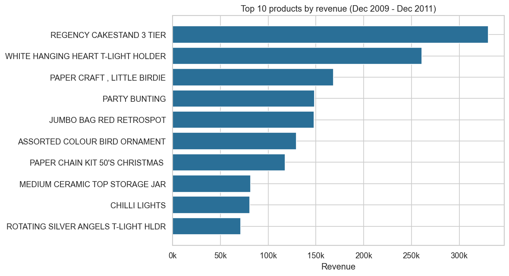
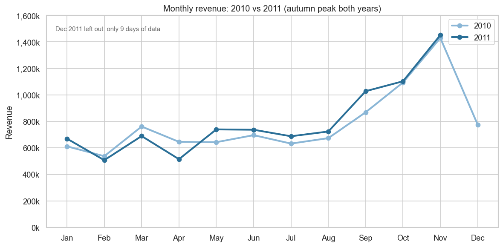
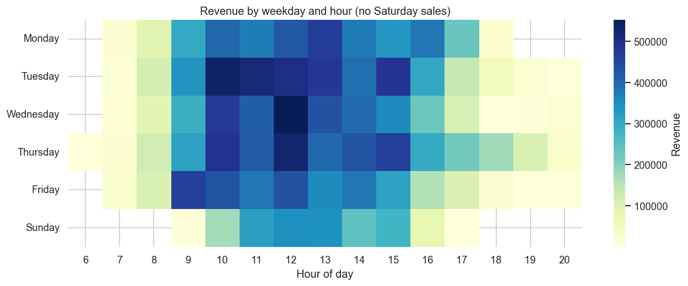
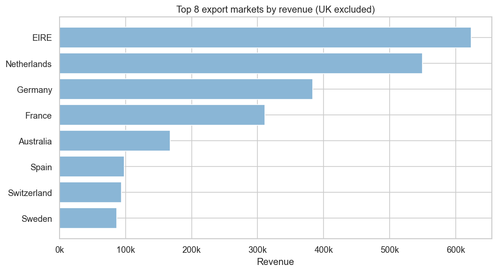
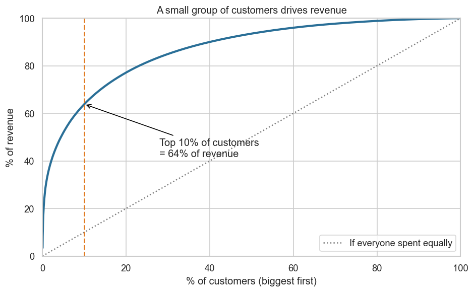

# Online Retail Sales Analysis: What Drives This Shop's Revenue?

A data cleaning and analysis project using two years of real transaction data from a UK online gift retailer. The goal: turn a messy, million-row dataset into clear answers a shop owner can act on.

**Tools:** Python, pandas, matplotlib, seaborn

---

## Business questions

1. Which products bring in the most revenue?
2. When do customers buy (month, weekday, hour), and is the business growing?
3. Which countries buy the most?
4. Who are the best customers, and how much do they matter?

## Dataset

[Online Retail II](https://www.kaggle.com/) (Kaggle / UCI Machine Learning Repository): 1,067,371 transactions from 1 December 2009 to 9 December 2011. Columns: invoice number, stock code, description, quantity, invoice date, unit price, customer ID, country.

The raw file is not included in this repository. Download it from Kaggle and place it in the project folder.

## Data problems found

Before cleaning, I inspected the data and documented these issues:

| Problem | Size |
|---|---|
| Exact duplicate rows | 34,335 |
| Cancelled invoices mixed in with sales | 19,494 |
| Rows with no product description | 4,382 |
| Rows with no customer ID | 243,007 (about 23%) |
| Rows with a price of zero | 6,202 |
| Negative quantities that are not cancellations | 3,457 |
| Negative prices ("Adjust bad debt" entries) | 5 |
| Non-product entries (postage, bank charges, Amazon fees, manual adjustments) with prices up to 38,970 | thousands of rows |
| Last month incomplete (data ends 9 December 2011) | n/a |

## Cleaning steps

| Step | Rows removed | Rows left |
|---|---|---|
| 1. Remove duplicate rows | 34,335 | 1,033,036 |
| 2. Set aside cancelled invoices | 19,104 | 1,013,932 |
| 3. Remove missing descriptions | 4,275 | 1,009,657 |
| 4. Remove zero or negative quantity/price | 1,744 | 1,007,913 |
| 5. Remove non-product entries (postage, fees, vouchers, adjustments) | 4,573 | 1,003,340 |

**Result:** 1,003,340 clean sales rows, 94.0% of the original data.

Rows without a customer ID (22.6% of clean rows) were kept for product, country and time analysis, and excluded only from the customer analysis. The step counts depend on the order of cleaning, because one row can have several problems.

## Key findings

1. **Autumn is the peak season.** October and November brought in about 2.5 million in both 2010 and 2011, roughly double a normal month. December is weaker.
2. **Growth is flat.** January to November 2011 was up 3.0% on the same months of 2010, but with large swings: September +18%, May +15%, April -20%.
3. **A few customers matter most.** The top 10% of identified customers generate 63.9% of revenue, and 72.4% have ordered more than once.
4. **The UK is the market.** It accounts for 85.5% of revenue. Ireland (3.2%), the Netherlands (2.8%) and Germany (2.0%) are the next largest.
5. **Sales are concentrated midweek and late morning.** Tuesday and Thursday together make up about 40% of revenue, with most sales between 10am and 3pm. No Saturday sales are recorded.
6. **No single product dominates.** The top 10 products make up only 7.8% of revenue. The Regency Cakestand earns the most, while the World War 2 Gliders sell the most units but earn little.

## Charts

### Top 10 products by revenue


The Regency Cakestand earns the most revenue, followed by the White Hanging Heart T-Light Holder.

### Monthly revenue, 2010 vs 2011


Revenue peaks in October and November in both years. December 2011 is left out because it has only 9 days of data.

### When customers buy


Sales cluster between 10am and 3pm from Tuesday to Thursday.

### Top export markets


Ireland and the Netherlands are the biggest export markets, though each is under 4% of total revenue.

### Customer concentration


The top 10% of customers bring in about 64% of revenue.

## Recommendations

- Have stock and staff ready by September for the October and November peak.
- Protect the top customers with a loyalty offer or early access to new stock.
- Investigate why February to April is weak, and test a spring promotion.
- Send email offers before 10am on Tuesday to Thursday, when buying peaks.
- Promote higher-value products over high-volume, low-price ones.

## Limitations

- The reasons behind patterns (for example, pre-Christmas stocking causing the autumn peak) are plausible explanations, not something this data proves.
- Customer figures cover only identified customers (77.4% of clean rows).
- The list of non-product stock codes was built from known patterns in this dataset and checked against the rows removed, but a few borderline entries may be misclassified.
- Two years of data show seasonality but are too short to establish a long-term trend.

## How to run

1. Install the libraries: `pip install pandas matplotlib seaborn`
2. Download the dataset and save it as `online_retail_II.csv` in the project folder.
3. Run the cleaning code. It creates `clean_sales.csv`, `cancellations.csv` and `cleaning_log.csv`.
4. Run the analysis code. It prints the findings and saves the `result_*.csv` files.
5. Run the charts code. It saves the PNGs in the `charts` folder.

## Project structure

```
Online-Retail-Analysis/
├── README.md
├── [your notebook or scripts]
├── clean_sales.csv
├── cleaning_log.csv
└── charts/
    ├── chart1_top_products.png
    ├── chart2_monthly_revenue.png
    ├── chart3_weekday_hour_heatmap.png
    ├── chart4_export_markets.png
    └── chart5_customer_concentration.png
```

## About me

[Sibahle VATHU]: [I analyse messy business data with Python and turn it into clear recommendations.]
[Email: vathusibahle@gmail.com]

